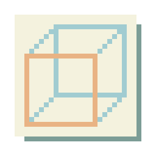
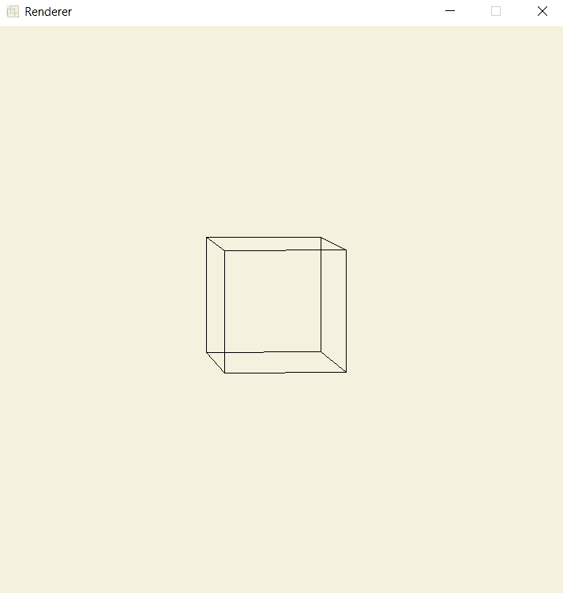

<a name="readme-top"></a>

<!-- PROJECT LOGO -->
<br />
<div align="center">
  <a href="https://github.com/duckmaniac/simple-renderer">
    
  </a>

  <h3 align="center">Simple 3D rendering</h3>

  <p align="center">
    Demonstration of a simple rendering algorithm implemented in my game engine.
    <br />
    Made on the Fly 🚀
    <br />
    <a href="https://github.com/duckmaniac/simple-renderer/issues">Report Bug</a>
  </p>
</div>

<!-- TABLE OF CONTENTS -->
<details>
  <summary>Table of Contents</summary>
  <ol>
    <li>
      <a href="#about-the-project">About The Project</a>
      <ul>
        <li><a href="#built-with">Built With</a></li>
      </ul>
    </li>
    <li>
      <a href="#getting-started">Getting Started</a>
      <ul>
        <li><a href="#prerequisites">Prerequisites</a></li>
        <li><a href="#compiling-from-source">Compiling from source</a></li>
      </ul>
    </li>
    <li><a href="#contributing">Contributing</a></li>
    <li><a href="#license">License</a></li>
    <li><a href="#contact">Contact</a></li>
    <li><a href="#acknowledgments">Acknowledgments</a></li>
  </ol>
</details>

<!-- ABOUT THE PROJECT -->
## About The Project

<a href="https://github.com/duckmaniac/simple-renderer">
  
</a>

Welcome to my 3D rendering demo project! This project showcases the capabilities of my own game engine's 3D rendering system. While creating this project, I ventured deep into the world of graphics programming, revisiting and applying core concepts of linear algebra, understanding the intricacies of perspective projection, rasterization, and much more.

Features:
* Using Bresenheim's algorithm for line rasterization
* Keyboard input support for rotation

<p align="right">(<a href="#readme-top">back to top</a>)</p>


### Built With

* [![C++][cpp]][cpp-url]
* [![CMake][cmake]][cmake-url]
* [![Fly][fly]][fly-url]

<p align="right">(<a href="#readme-top">back to top</a>)</p>


<!-- GETTING STARTED -->
## Getting Started

### Prerequisites

To build this demo on your system, ensure:

* You have a CMake to build a project.
* Fly Engine 0.1.0 library is set up and ready.
* In order to run this code, you will need a Windows operating system.

### Compiling from source

1. Clone the repo
   ```sh
   git clone https://github.com/duckmaniac/simple-renderer.git
   ```
2. Navigate to project's root directory
   ```sh
   cd "path to dowloaded repo"
   ```
3. Set up path to libraries in CMakeLists.txt
   ```cmake
   set(CPP_LIBRARIES_DIR "path to libraries")
   set(SFML_DIR "${CPP_LIBRARIES_DIR}/SFML-2.6.0/lib/cmake/SFML")
   find_package(FLY REQUIRED PATHS "${CPP_LIBRARIES_DIR}/Fly Engine/lib/cmake")
   ```
4. Run the configuration command
   ```sh
   cmake .
   ```
5. Build the project
   ```sh
   cmake --build .
   ```

<p align="right">(<a href="#readme-top">back to top</a>)</p>


<!-- CONTRIBUTING -->
## Contributing

Contributions are what make the open source community such an amazing place to learn, inspire, and create. Any contributions you make are **greatly appreciated**.

If you have a suggestion that would make this better, please fork the repo and create a pull request. You can also simply open an issue with the tag "enhancement".
Don't forget to give the project a star! Thanks again!

1. Fork the Project
2. Create your Feature Branch (`git checkout -b feature/AmazingFeature`)
3. Commit your Changes (`git commit -m 'Add some AmazingFeature'`)
4. Push to the Branch (`git push origin feature/AmazingFeature`)
5. Open a Pull Request

<p align="right">(<a href="#readme-top">back to top</a>)</p>


<!-- LICENSE -->
## License
Distributed under the MIT License. See `LICENSE.txt` for more information.

<p align="right">(<a href="#readme-top">back to top</a>)</p>


<!-- CONTACT -->
## Contact

Dmitrii Tarbaev - dmitry.tarbaev@gmail.com

<p align="right">(<a href="#readme-top">back to top</a>)</p>


<!-- ACKNOWLEDGMENTS -->
## Acknowledgments

* [SFML Library](https://www.sfml-dev.org/): made it easier to create this project
* [Computer Graphics (CMU 15-462/662)](https://www.youtube.com/watch?v=W6yEALqsD7k&list=PL9_jI1bdZmz2emSh0UQ5iOdT2xRHFHL7E): amazing computer graphics course that inspired me to make this project
  
<p align="right">(<a href="#readme-top">back to top</a>)</p>


<!-- MARKDOWN LINKS & IMAGES -->
[cpp]: https://img.shields.io/badge/c++-%2300599C.svg?style=for-the-badge&logo=c%2B%2B&logoColor=white
[cmake]: https://img.shields.io/static/v1?style=for-the-badge&message=CMake&color=064F8C&logo=CMake&logoColor=FFFFFF&label=
[fly]: https://img.shields.io/badge/0.1.0-%20%23fc74ac?label=FLY&labelColor=%23fc74ac&color=%23fcf42c
[cpp-url]: https://cplusplus.com/
[cmake-url]: https://cmake.org/
[fly-url]: https://github.com/duckmaniac/fly-engine
